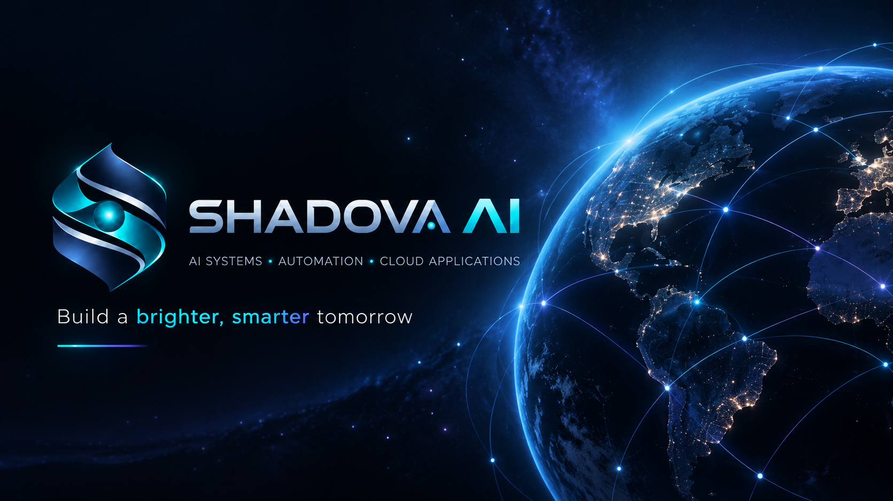

  

*Portfolio brand banner*

# James Busby — Shadova AI

### AI Solutions, Web Applications & Technical Implementation Specialist

I design and implement practical AI-enabled business systems, responsive websites and web applications that connect frontend experiences, cloud infrastructure, automation, databases, APIs, and business workflows.

## Featured portfolio

| Project | Focus | Repository |
|---|---|---|
| **Covia AI** | AI business operations, Business Twin, decision support, approvals and governed automation | [View Covia AI](https://github.com/shadovaai/Covia-ai) |
| **BizNova** | AI-assisted commerce, inventory, publishing and operational control | [View BizNova](https://github.com/shadovaai/biznova) |
| **Spirit Vibestik** | Member platform, guided journeys, digital content, community and AI-assisted experiences | [View Spirit Vibestik](https://github.com/shadovaai/spiritvibetik) |

## Web & app delivery

- Responsive business websites and product landing experiences
- Frontend implementation for web applications and dashboards
- Mobile-first UI and customer/member portals
- Ecommerce and digital-product experiences
- API-connected applications, authentication and payments
- Rapid prototypes, staging environments and production handoff

## What I build

- AI workflow and business-process automation
- Business dashboards and operational control systems
- Web application architecture and implementation
- Cloud-connected applications and API integrations
- Authentication, role-based access, payments and member systems
- GitHub-based development, staging and production delivery
- Database-backed workflows with auditability and human approval controls

## Technical toolkit

**AI & Automation**  
LLM workflows · agent-style routing · prompt systems · workflow automation · decision support

**Application Development**  
React · TypeScript · JavaScript · responsive websites · web applications · UI implementation · Python integrations

**Cloud & Delivery**  
GitHub · Docker · cloud hosting · staging/production workflows · deployment handoff

**Data & Integrations**  
Databases · REST APIs · authentication · email integrations · payment/content systems

**Engineering Practice**  
Testing · debugging · role-based access · audit trails · implementation documentation

## Delivery approach

## Open to opportunities

Remote or hybrid roles in web application development, frontend implementation, technical implementation, solutions engineering, AI automation, application support, and business systems.

## Portfolio policy

My production systems remain private. Public repositories are intentionally sanitized and contain architecture, product thinking, selected implementation patterns, and safe examples only.

I do not publish production credentials, customer data, private infrastructure, proprietary prompts, internal AI services, or live environment configuration.

---

### Shadova AI

**Building AI-powered business systems, automation, cloud applications and digital products.**